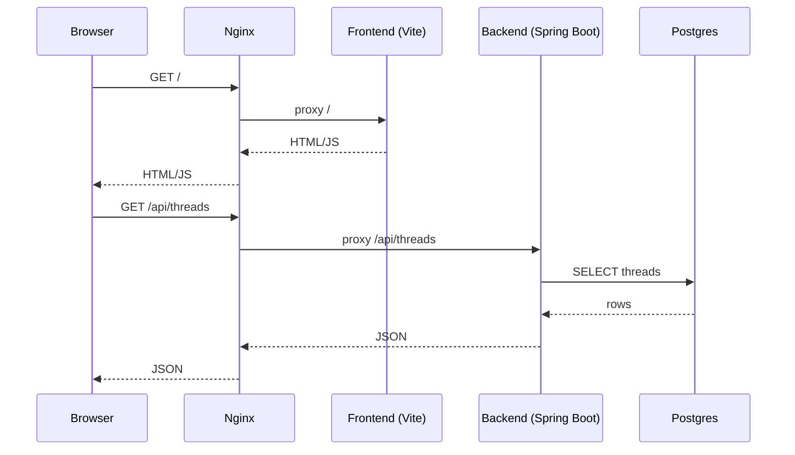

# thredge

하나의 아이디어를 하나의 스레드로 만들고, 댓글을 시간 순서로 쌓아가며
사고를 발전시키는 완전 개인용(thread-first) 사고 로그 앱입니다.
Notion 같은 거대 올인원 툴을 지양하고, UI/기능을 최소화해
생각의 시간성, 당시의 완성된 문장, 맥락(context) 보존에 집중합니다.

## 문서
- 작업 계획: `docs/archive/1.THREDGE_IMPLEMENTATION_PLAN.md`
- 기술 스택: `docs/archive/2.THREDGE_TECH_STACK.md`
- 로컬 개발: `docs/DEV.md`
- OpenAPI: `docs/OPENAPI.md`

## 로컬 실행(요약)
- 실행: `docker compose up --build`
- Frontend: `http://localhost:8082`
- Backend health(API): `http://localhost:8082/api/health`

## 아키텍처
로컬 개발 기준으로, Nginx가 단일 진입점 역할을 하며 `/` 요청은 프론트엔드로,
`/api/*` 요청은 백엔드로 프록시되고, 백엔드는 PostgreSQL과 통신합니다.
```mermaid
flowchart LR
  U[Browser] -->|HTTP :8082| N[Nginx]
  N -->|/| F[Frontend (Vite dev server :5174)]
  N -->|/api/*| B[Backend (Spring Boot :28080)]
  B -->|JDBC| D[(PostgreSQL :5432)]
```

## 요청/응답 플로우
브라우저에서 최초 페이지 로드 이후, API 요청이 동일한 Nginx 엔드포인트를 통해
백엔드로 전달되고 응답이 다시 브라우저로 전달됩니다.

